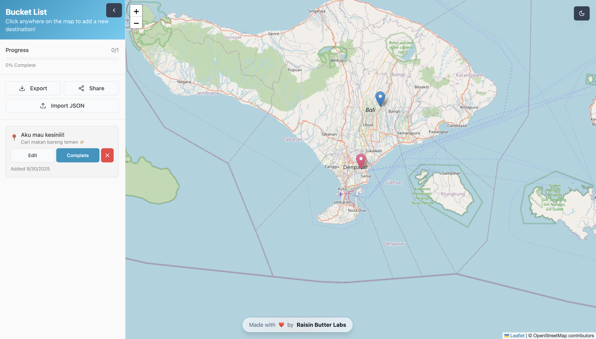

# Personal Bucket List Map

Create your personal bucket list by clicking locations on an interactive map. Track your adventures, add notes, and share your journey! Data is stored locally in your browser, so you can use it instantly with zero setup.

This repository is open for Hacktoberfest contributions.



Author: Raisin Butter Labs

## Tech stack

-   Vite + React + TypeScript
-   Tailwind CSS + shadcn/ui (Radix primitives)
-   Leaflet (OpenStreetMap tiles)
-   React Router

## Features

-   Add locations by clicking on the map
-   Edit title, emoji, and description in a dialog
-   Mark locations as completed (green markers)
-   Light/Dark map tiles toggle
-   Responsive sidebar with list management (edit/delete/import)
-   Autosave to `localStorage`

## Getting started

### Prerequisites

-   Node.js 18+ and npm

### Run locally

```bash
git clone <your-fork-or-repo-url>
cd my-map-memories-main
npm install
npm run dev
```

Open the printed local URL (typically `http://localhost:5173`).

### Useful scripts

-   `npm run dev`: start Vite dev server
-   `npm run build`: production build
-   `npm run build:dev`: development-mode build
-   `npm run preview`: preview production build
-   `npm run lint`: run ESLint

## Project structure

```
src/
  components/
    InteractiveMap.tsx        # Leaflet integration, markers, popups, dark tiles
    BucketListSidebar.tsx     # List management UI
    EditLocationDialog.tsx    # Edit form for a location
    ui/                       # shadcn/ui components
  pages/
    Index.tsx                 # Main page wiring map + sidebar + toasts
  hooks/                      # toast + mobile helpers
  types/                      # shared types (e.g., BucketListItem)
  main.tsx, App.tsx          # app bootstrap & routing
```

How it works at a glance:

-   `InteractiveMap` initializes Leaflet, handles map clicks to create items, and binds popup buttons to window events for edit/toggle/delete.
-   `Index` stores the bucket list in React state and persists it to `localStorage`.
-   Completed items get a green marker; the theme toggle switches tile layers.

## Contributing (Hacktoberfest)

We welcome first-time contributors. Please follow the steps below:

1. Fork the repo and clone your fork.
2. Create a feature branch: `git checkout -b feat/your-idea`.
3. Install dependencies and run `npm run dev`.
4. Make changes, ensure `npm run lint` passes, and test locally.
5. Commit with a clear message and push your branch.
6. Open a Pull Request to this repo’s `main` branch.

Tips for a speedy review:

-   Keep PRs focused and under ~300 lines when possible.
-   Add before/after screenshots or a short clip for UI changes.
-   Describe the change, motivation, and testing steps in the PR body.

### Good first contribution ideas

-   UI polish: accessibility labels, keyboard navigation in dialogs
-   Map UX: custom marker icons, clustering for many points
-   Data: export/import JSON enhancements, CSV import, validations (zod)
-   Features: search/filter in sidebar, categories/tags, sorting
-   Performance: memoization, virtualization for long lists
-   Testing: add unit tests for utilities/components
-   Docs: GIF demo, improved screenshots, more examples

### Code style

-   TypeScript preferred; annotate public APIs and props.
-   Run `npm run lint` and fix issues before pushing.
-   Follow existing formatting and component patterns; keep names descriptive.

## Acknowledgements

-   Map tiles © OpenStreetMap contributors and © CARTO
-   [Leaflet](https://leafletjs.com/) for mapping
-   [shadcn/ui](https://ui.shadcn.com/) and Radix UI primitives

## License

If this repository includes a `LICENSE` file, that license applies. If not, the project is currently unlicensed; you may open an issue to discuss licensing (MIT is a common default for Hacktoberfest repos).
